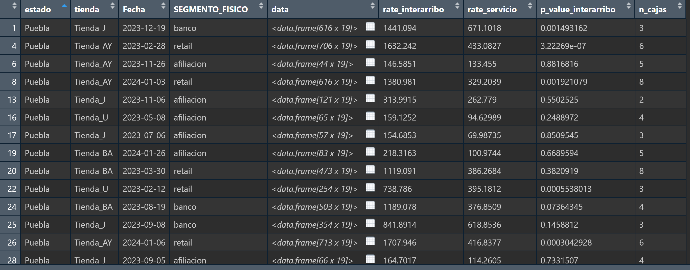
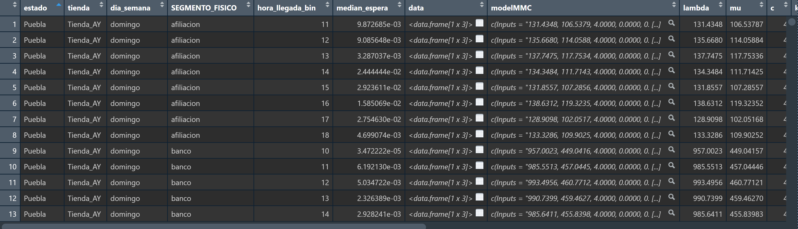
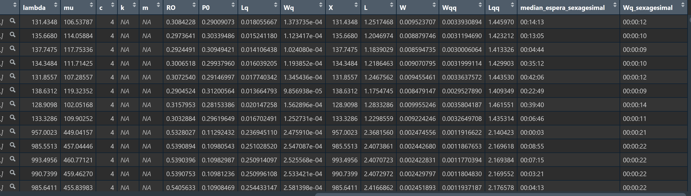

# Parte 1: Exploracion

## Exploracion general

```{r}

library(fitdistrplus)
library(tidyverse)
library(queueing)
library(kableExtra)


dfRaw <- vroom::vroom(file = '../RawData/data_sst_reto_coppel.csv', delim = ',')

str(dfRaw)

# cargar funciones auxiliares
source('../Code/R/utils.R')


```

Veamos como estan los datos


```{r}
glimpse(dfRaw)
```

los tipos de datos son correctos, aunque las horas de llegada, llamado y salida 
vienen en double

Falta transformar a la hora en sitema sexagesimal para una mejor apreciacion
de los datos


```{r}
dfRaw |> 
  summarise(across(everything(), \(x)sum(is.na(x)))) |> 
  kbl() |> 
  kable_classic()
```

veo que no hay ningun NA, y aparentemente la data esta limpia, es decir,
no hay errores de captura o correcciones neesarias

---

conteo de observaciones por tienda y por estado

```{r}

dfRaw |> 
  count(estado, tienda) 
```


---

Veamos como esta la informacion por estados


```{r}
dfRaw |> 
  count(estado)
```

tenemos informacion de 23 estados

--- 

numero de tiendas por estados ordenados de mayor al menor

```{r}
dfRaw |> 
  count(estado,tienda) |> 
  count(estado) |> 
  arrange(desc(n)) |> 
  kbl() |> 
  kable_classic(full_width=F, html_font = "Cambria")
```

vemos que nuevo leon, puebla, sinaloa y veracruz 
son los que tienen mas tiendas, teniendo 4

---

ver los diferentes valores de cada variable

```{r}
map(.x = dfRaw,.f = \(x) x |> as_tibble() |> distinct())
```

vemos que hay 50 tiendas, 77 cajas aunque esas cajas en realidad no
son unicas
3 segmentos
tenemos informacion de 396 dias

---

Cuales cajas hay?

```{r}
dfRaw |> 
  count(caja) 
```
como era de esperarse, no todas las tiendas tienen el mismo numero de cajas
y en la mayoria de las tiendas se observa que hay mas cajas de retail y bancos

> Conclusion 

> Parece que es mejor explorar la informacion dividida esta por grupos,
> la division natural que se me ocurre es:
> estado > tienda > fecha (dia)

## Exploracion de una sola estado

<!-- Para ver como viene la informacion escogeremos na tienda y la revisaremos -->

A modo de muestra escogeremos solo el estado de puebla y lo revisaremos

```{r}
dfRaw |> 
  filter(estado == 'Puebla') |> 
  group_by(tienda) |> 
  summarise(n())
```
La tienda con mayor numero de observaciones es la BA

---

Veamos cual de las tiendas de puebla tiene mayornumero de cajas
```{r}
dfRaw |> 
  filter(estado == 'Puebla') |> 
  group_by(tienda, caja) |> 
  summarise(n=n()) |> 
  count(tienda) 
```
como era de esperase, la tienda mas grande 'tienda_BA' tiene mayor numero de
cajas


---

Ver los tipos de cajas que existen en estas tiendas de puebla
```{r}
dfRaw |> 
  filter(estado == 'Puebla') |>
  count(caja, tienda) |> 
  count(caja) 

```
no todas las tiendas en puebla tienen promotoria, algunas solo
cajas y ventanillas

---

```{r}
dfRaw |> 
  filter(estado == 'Puebla', tienda == 'Tienda_BA') |> 
  count(caja) 
```
en esta tienda solo hay 37 cajas

---

Veamos las observaciones de una sola tienda

```{r}
dfRaw |> 
  filter(estado == 'Puebla', tienda == 'Tienda_BA')
```

> vemos que hay algunas observaciones que el segmento es diferente al
> caja en la que fue atendido como se habia explicado en las sesiones
> de teams

## Exploracion cajas

hay unas cajas que tienen su nombre en mayusculas, causa intriga que no son
tantas observaciones, veamos esas observaciones

```{r}
dfRaw |> 
  filter(caja %in% paste0('Caja_', letters[1:5]))
```


```{r}
dfRaw |> 
  filter(caja %in% paste0('Caja_', letters[1:5])) |>
  count(estado)
```


```{r}
dfRaw |> 
  filter(caja %in% paste0('Caja_', letters[1:5])) |>
  count(tienda)
```


```{r}
dfRaw |> 
  filter(estado == 'Ciudad de México') |> 
  distinct(caja)
```


```{r}
dfRaw |> 
  filter(estado == 'Ciudad de México') |> 
  count(Segmento, caja) |> 
  View()
```
> Conclusion:

parece que en realidad todas las observaciones pertenecen a un solo estado,
ay dos observaciones que son de otros dos estados, podria deberse a un error
debido a la forma en como se generaron los datos


y tambien parece que todas pertenecen a la misma tienda, supongo que fueron
los datos que en la simulacion se generaron primero y luego en los siguientes
se cambio la instruccion para que las cajas sean con minuscula.

parece que las observaciones las generaron por tienda por el patron que se
tiene

Creo recomendable estudiar esta tienda por separado, ya que no parece seguir
el mismo comportamiento de las otras tiendas
Tiena_AA ciudad de mexico


# Parte 2: Prepocesamiento

Derivado de nuestro analisis exploratorio, y de las sesiones de dudas en vivo
del reto coppel, concluimos despues de un cuidadoso razonamiento que el proceso fisico que se lleva a cabo en las tiendas coppel es el siguiente:

Al llegar a la tienda, dependiendo de su tramite, el cliente es mandado a una fila
en donde esperara a ser atendido, esta fila puede ser alguno de los siguientes tres segmentos: banco, retail o promotoria, y aunque el cliente pueda ser dirigido a una fila, y terminar su proceso en otro, cuando un cliente es redirigido a una nueva fila, 
este cliente tiene que esperar a ser atendido en este nuevo segmento, (esto lo concluimos despues de analizar esas observaciones en donde el cliente inicia su proceso en un lado y termina en otro), es decir, en realidad cada uno de estos segmentos corresponde a un sistema indpendiente de lineas de espera. Y llas observaciones que inician su tramite en un lado pero terminan en otro, en realidad perteecen a este ultimo, ya que es en esa fila en donde esta esperando y en donde contribuye a que aumenten los tiempos de espera para los otros clientes.

Por tanto se procede a crear una nueva variable con el segmento real al que pertenecen, que es en base a la caja a la que realiza su tramite, caja para retail, ventanilla para banco y p para promotoria.

Asi, cada uno de estas filas son procesos independientes y pueden corresponder a un modelo de colas G/G/C

Es decir, para cada dia, en cada tienda se llevan a cabo de manera independiente tres procesos de filas de espera.


igualmete se hara una conversion a hora sexagesimal para poder entender 
 de mejor manera los horarios, ya que aunque en el analisis no influya el 
 como esten representadas estas horas, para el entendimiento humano si hara
 mas sentido si los tiempos los tenemos en formal natural.

```{r}
dfRaw |> 
  mutate(hora_llegada_sexagesimal = as_sexagesimal(hora_llegada),
         hora_llamado_sexagesimal = as_sexagesimal(hora_llamado),
         hora_salida_sexagesimal = as_sexagesimal(hora_salida)) |> 
  ggplot(aes(x = hora_llegada_sexagesimal)) + 
  geom_histogram() 

```

Parece que hay algunas observaciones con horarios de llegada fuera de un horario 
de atencion normal en una tienda


veamos donde estan la mayoria de las observaciones
```{r}
dfRaw |> 
  mutate(hora_llegada_sexagesimal = as_sexagesimal(hora_llegada),
         hora_llamado_sexagesimal = as_sexagesimal(hora_llamado),
         hora_salida_sexagesimal = as_sexagesimal(hora_salida)) |> 
  mutate(hora_bin = hour(hora_llegada_sexagesimal)) |> 
  count(hora_bin)
```


```{r}
dfRaw |>
  slice_sample(prop = 0.01) |> 
  mutate(hora_llegada_sexagesimal = as_sexagesimal(hora_llegada),
         hora_llamado_sexagesimal = as_sexagesimal(hora_llamado),
         hora_salida_sexagesimal = as_sexagesimal(hora_salida)) |>
  mutate(hora_bin = hour(hora_llegada_sexagesimal)) |>
  nest(.by = c(estado,tienda)) |> 
  glimpse()
```

> Aqui estamos particionando la data de acuerdo al estado y tienda

> Debido a que no cuento con una computadora muy poderosa, tomare una muestra de unicamente dos estados para hacer algunos test, pero estos analisis perfectamente
se pueden hacer con todas las demas observaciones

## Clean and Feauture enrichment 


```{r}
dfSample <- dfRaw |> 
  filter(estado == 'Puebla' | estado == 'Sonora') |> 
  mutate(hora_llegada_sexagesimal = as_sexagesimal(hora_llegada),
         hora_llamado_sexagesimal = as_sexagesimal(hora_llamado),
         hora_salida_sexagesimal = as_sexagesimal(hora_salida)) |> 
  mutate(hora_llegada_bin = hour(hora_llegada_sexagesimal))

dfSample


```

nos quedaremos con las observaciones que tienen logica,
escribir aqui la justificacion de porque retiramos estas
IMPORTANTE

ver cuantas observaciones voy a quitar
En el caso de hora llegada, la mayoria de estas observaciones
hora llegada fuera de horario de tienda, tienen una hora de salida
casi justo al horario de apertura de la tienda, por lo cual
se puede deducir que al inicio del dia, se revisa qe no haya
tickets en espera y se cancelan esos


```{r}
dfSample <- dfSample |> 
  filter( (hora_llegada<=hora_llamado & hora_llamado<=hora_salida & hora_llegada<=hora_salida) ) |> 
  filter(hora_llegada_bin >= 8 & hora_llegada_bin<=22) |> 
  mutate(
    SEGMENTO_FISICO = case_when(
      str_starts(str_to_lower(caja), 'caja') ~ 'retail',
      str_starts(str_to_lower(caja), 'p') ~ 'afiliacion',
      str_starts(str_to_lower(caja), 'ventanilla') ~ 'banco',
      .default = 'error'),
    dia_semana = wday(Fecha, label = T, abbr = F),
    dias_finde = 
      if_else(dia_semana %in% c('viernes', 'sábado', 'domingo'),
              'fin de semana', 'entre semana'))|> 
  rename(Id=...1) |> 
  relocate(estado, tienda, Fecha, dia_semana, dias_finde,
           hora_llegada_sexagesimal, hora_llamado_sexagesimal,
           hora_salida_sexagesimal,
           Segmento, SEGMENTO_FISICO, caja, status, hora_llegada, 
           hora_llamado, hora_salida, Id)

dfSample
```

> Para poder analizar los datos de las llegadas de los clientes es necesario observar su comportamiento

```{r}
dfSampleClean <- dfSample |> 
  group_by(estado, tienda, Fecha, SEGMENTO_FISICO) |> 
  arrange(hora_llegada, .by_group = T) |> 
  mutate(interarribo =
           hora_llegada - lag(hora_llegada)) |> 
  mutate(
    tiempo_espera = hora_llamado - hora_llegada,
    tiempo_servicio = hora_salida - hora_llamado) |> 
  ungroup() |>
  mutate(interarribo_sexagesimal = as_sexagesimal(interarribo),
         tiempo_espera_sexagesimal = as_sexagesimal(tiempo_espera),
         tiempo_servicio_sexagesimal = as_sexagesimal(tiempo_servicio)) |> 
  relocate(estado, tienda, Fecha, dia_semana, dias_finde, Segmento, SEGMENTO_FISICO, 
           hora_llegada_sexagesimal, interarribo_sexagesimal,
           hora_llamado_sexagesimal, tiempo_espera_sexagesimal,
           hora_salida_sexagesimal, tiempo_servicio_sexagesimal,
           caja, status, hora_llegada, 
           hora_llamado, hora_salida, , hora_llegada_bin, Id)


glimpse(dfSampleClean)


dfSampleClean
```


```{r}
dfSampleClean |> 
  filter(is.na(interarribo_sexagesimal))
```

JUSTIFICACION DE PORQUE SE DEJAN LAS OTRAS VARIABLES INTACTAS
PARA LLAS SALIDAS, PUEDE QUE SEAN VERDADERAS O FALSAS, YA QUE
ALGUN CLIEMTE PUDO QUEDARSE EN LA TIENDA HASTA QUE LE RESOLVIERAN SU
cSITUACION Y GENUINAMENTE ESAS OBSERVACIONES REPRESENTEN A ESOS
VLIENTES, SIN EMBARGO LO MAS PROBABLE ES QUE SEAN TICKETS QUE A
LOS CAJEROS SE LES OLVIDO MARCAR SU HORA DE SALIDA, SIENDA HASTA HORAS
DESPUES QUE SE 'CIERRAN' AQUELLOS TICKETS, LAMENTABLEMENTE UNICAMENTE
CON LA INFORMACION DE LOS DATOS NO HAY FORMA DE DETERMINAR CUALES SI Y
CUALES NO PERTENECEN A CADA UNO, SIN EMBARGO ESTAS OBSERVACIONES
SI DAN INFORMACION ACERCA DE LOS TIEMPO DE LLEGADA, INTERARRIVO
cDE LOS CLIETES, ASI COMO DEL TIEMPO EN ESPERA EN LA FILA,
POR TANTO, ESTAS OBSERVACIONES SE DECIDE DEJARLAS TAL CUAL ESTAN

---

DISTRIBUCION DE LOS DATOS DE ACUERDO AL DIA DE LA SEMANA

```{r}
dfSampleClean |> 
  ggplot(aes(x = dia_semana)) + 
  geom_bar()
```
DISTRIBUCION DE ACUERDO A LA HORA DEL DIA


JUSTIFICAR EL PORQUE DE ESTA DIVISION CON LOS ARTICULOS QUE MANDE

```{r}
dfSampleClean |> 
  ggplot(aes(x = hora_llegada_bin)) +
  geom_bar()
```


```{r}
# veamos al final con cuanto nos quedamos por grupo
dfSampleClean |> 
  count(hora_llegada_bin)
```


```{r}
dfSampleClean |> 
  group_by(estado, tienda, Fecha, SEGMENTO_FISICO) |> 
  summarise(promedio_espera = as_sexagesimal( mean(tiempo_espera)))
```


## Data Nest

Con la justificacion dada al el inicio del procesamiento de datos, se contruye la 
siguiente estructura de datos en la cual se anidan conjuntos de datos para cada grupo,
permitiendo asi poder estudiar cada uno de estos grupos (particion) de manera simultanea


```{r}
# Particion datos
dfSampleAgrupado <- dfSampleClean |>
  nest(.by = c(estado, tienda, Fecha, SEGMENTO_FISICO))

```


```{r}
dfSampleAgrupado |> 
  glimpse()
```

# Parte 3: Seleccion Modelo

Con los datos agrupados de la forma anterior, queda comprobar si nuestra 
variable de interarribo  y tiempo de servicio  siguen una distribucion exponencial, ya que de ser asi, podemos ajustar nuestro sistema a un modelo M/M/c, donde el numero de cajas es variable para cada tienda.

ASI QUE PARA CADA GRUPO COMPROBAREMOS QUE SI EFECTIVAMENTE SE SIGUE ESA
DISTRIBUCION


```{r}

fun_pvalue_serv <- function(df) {
  ajExp <- fitdist(as.numeric(na.omit(df$tiempo_servicio)), 'exp', method = 'mle')
  test <-  ks.test(as.numeric(na.omit(df$tiempo_servicio)), 'pexp', rate = ajExp$estimate)
  
  return(test$p.value)
}
fun_rate_serv <- function(df) {
  ajExp <- fitdist(as.numeric(na.omit(df$tiempo_servicio)), 'exp', method = 'mle')
  return(ajExp$estimate)
}


fun_pvalue_inter <- function(df) {
  ajExp <- fitdist(as.numeric(na.omit(df$interarribo)), 'exp', method = 'mle')
  test <-  ks.test(as.numeric(na.omit(df$interarribo)), 'pexp', rate = ajExp$estimate)
  
  return(test$p.value)
}
fun_rate_inter <- function(df) {
  ajExp <- fitdist(as.numeric(na.omit(df$interarribo)), 'exp', method = 'mle')
  return(ajExp$estimate)
}

```


```{r}

dfSampleAgrupado2 <- 
  dfSampleAgrupado |> 
  slice_sample(prop = 0.05) |> 
  mutate(
    rate_interarribo =
      map(data,
          possibly(fun_rate_inter)),
    rate_servicio =
      map(data, possibly(fun_rate_serv)),
    p_value_interarribo = 
      map(data, 
          possibly(fun_pvalue_inter)),
    # p_value_servicio = 
    #   map(data, 
    #       possibly(fun_pvalue_serv)),
    n_cajas = 
      map(data, possibly(\(x) {x |> distinct(caja) |> nrow() }) )
  ) 


```
```{r}
dfSampleAgrupado2 |> 
  glimpse()
```
Podemos ver que efectivamente, para cada uno de esos grupos, que corresponde a un segmento en un dia, para cada tienda, en cada estado, se sigue una distribucion exponencial de los datos de interarribo y tiempos de servicio




```{r}
dfSampleAgrupado2 <- dfSampleAgrupado2 |> 
  unnest(n_cajas, p_value_interarribo, rate_servicio, rate_interarribo, data)

```
> ENTONCES AJUSTAREMOS UN MODELO M/M/C


# Parte 4: MODELO DE SISTEMA DE COLAS M/M/C

Con base en lo anterior, y en los siguietes articulos, vemos que el comportamiento de los
clietes varia a lo largo del a;o, no es lo mismo los tiempos de espera en la ma;ana que en la tarde, asi como tampoco los fines de semana o entre semana.

Como el objetivo de nuestro estudio es encontrar una forma de reducir los tiempos de espera,
concluimos que la mejor forma de modelar estos sistemas es analizando el comportamiento por hora del dia, y dia de la semana (mencianar articulos cientificos), asi, para cada grupo conformado por una hora del dia, un dia de la semana, para cada tienda, obtendremos su modelo

Esto lo haremos igual que usando 'nested data frames' y aplicando el modelo para cada grupo

```{r}

df22 <- dfSampleAgrupado2 |> 
  group_by(estado, tienda, dia_semana, SEGMENTO_FISICO, hora_llegada_bin) |> 
  summarise(rate_interarribo = mean(rate_interarribo, na.rm=T, trim=0.05),
            rate_servicio = mean(rate_servicio, na.rm=T, 0.05),
            n_servers = round(mean(n_cajas, na.rm=T)),
            median_espera = median(tiempo_espera))

```
```{r}
df22
```


Ahora ajustamos el modelo

```{r}
df33 <- df22 |>
  ungroup() |> 
  # nest(.by = c(estado, tienda, dia_semana, hora_llegada_bin)) |> 
  nest(rate_interarribo,rate_servicio,n_servers) |> 
  mutate(modelMMC= map(data, possibly(\(x) {
    input <- NewInput.MMC(lambda = x$rate_interarribo, mu = x$rate_servicio, c = x$n_servers)
    model <- QueueingModel(input)
    return(model)
    
  } ))) |> 
  mutate(Resumen_model = map(data, possibly(\(x) {
    input <- NewInput.MMC(lambda = x$rate_interarribo, mu = x$rate_servicio, c = x$n_servers)
    model <- QueueingModel(input)
    resumen <- summary(model)
    
    return(as_tibble(resumen$el))
    
  } )))  |> 
  unnest(Resumen_model) |> 
  mutate(median_espera_sexagesimal = as_sexagesimal(median_espera),
         Wq_sexagesimal = as_sexagesimal(Wq))

```

```{r}
glimpse(df33)
```








# Parte 5: Optimizacion

ESTO ES LO MAS IMPORTANTE

Con esta estructura, en donde para cada hora del dia y cada dia de la semana en cada tienda 
tenemos el modelo que describe como se comporta el sistema de filas de espera en cada segmento,
podemos entonces buscar una forma de optimizar estos tiempos,

para esto nos basaremos en la variable que creamos de tiempo de espera limite, que es el tiempo
a partir del cual los cliemtes empiean a abandonar las filas 

(aqui hacer una mejor explicacion)

Para lograr esto, modelaremos para cada rupo como se comportan el sistema con mas o menos servidores
y observaremos su tiempo de espera en fila (Wq) (es resultado del modelo)


por ejemplo, para un caso particular que corresponde a la tienda AY del estado de puebla, en 
un dia domingo, a las 19:00 hrs del dia se tiene que:

```{r}
i <- 10
# df33$modelMMC[[i]] |> summary()

modeltemp <- df33$modelMMC[[i]]
# modeltemp$Inputs$lambda
# modeltemp$Inputs$mu

# summary(modeltemp)

# df33 |> View()

# OPTIMIZAR UN MODELO
servers <- 1:10

ltemp <- map_vec(servers,possibly(\(x) {
  inp <- NewInput.MMC(lambda = modeltemp$Inputs$lambda,
                      mu = modeltemp$Inputs$mu,
                      c = x)
  model22 <- QueueingModel(inp)
  return(Wq(model22))
}, otherwise = NA) )

# str(ltemp)

# View(ltemp)

df55 <- tibble(
  servers=servers,
  Wq=ltemp
)
```


Tenemos aqui sus correspondientes tiempos de espera dependiendo del numero de servidores

```{r}
df55 |> 
  kbl() |> 
  kable_classic(full_width = F)
```


ASi podemos ahora compararlo con el tiempo de espera limite, (el cual calculamos con la mediana)
y explicar el porque de la madiana.

En general no tiene que ser obligatoriamente ese criterio, puede ser cualquier otro. por eso es que se divide nuestro estudio en 5 partes
```{r}

df55 |> 
  na.omit() |> 
  ggplot(aes(x = servers, y = as_sexagesimal(Wq))) + 
  geom_line(color='blue') +
  geom_hline(yintercept = df33$median_espera_sexagesimal[i], color='red')


```
Ahora graficamos el desempe;o de estos modelos (recordar que esto es solo para uno de los grupos, osea las 7pm en domingo en la tienda AY)

Vemos que el numero de servidores actual es:

```{r}
df33$c[i]
```
Sin embargo vemos que el numeor optimo de servidores es el numero maximo que este por debajo del tiempo
de espera limite que en este caso es de 6 servidores.

> Conclusion

Este forma de modelar los datos, nos permite ajustar para cada hora del dia el numero optimo
de cajas a tener en servicio para reducir en numero de climetes que abandonan las filas.


